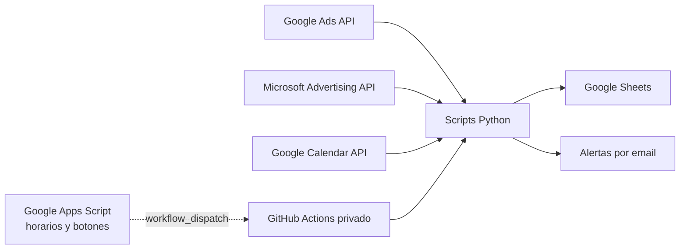

# Automatización de Operaciones Publicitarias

[English](README.md) | **Español**

Proyecto de automatizacion SEM que sustituye de forma parcial y dirigida los
queries diarios de Supermetrics por integraciones directas con Google Ads,
Microsoft Advertising, Google Sheets y Google Calendar.

Este repositorio es una demostracion publica y anonimizada de la arquitectura.
No esta conectado a la infraestructura de produccion, no contiene credenciales
y no puede acceder a cuentas publicitarias ni hojas reales.

## El Problema Que Resuelve

La operativa SEM necesita actualizar diariamente dos tipos de controles:

1. Consumos diarios y acumulados por cuenta publicitaria.
2. Fichas de cliente con rendimiento de campanas, saldo, presupuesto y
   bloques historicos.

Antes, buena parte de esos datos dependia de Supermetrics. Esta solucion
consulta directamente las APIs publicitarias y escribe los resultados en
Google Sheets con reglas de negocio propias. Con ello se obtiene:

- control exacto sobre cuentas, periodos y estados;
- actualizaciones idempotentes, sin duplicar filas;
- menos escrituras gracias a operaciones por bloques;
- soporte para reajustes retrospectivos de gasto;
- automatizacion de cambios de mes y de ano;
- verificaciones adicionales que no formaban parte del query original.

## Funcionalidades

### Control de consumos

`scripts/actualizar_consumos.py`:

- descubre cuentas finales bajo uno o varios MCC;
- incluye cuentas con gasto aunque esten pausadas o suspendidas;
- consulta gasto diario y mensual;
- actualiza el mes actual y el anterior para recoger ajustes posteriores;
- crea las hojas del nuevo mes o ano a partir de plantillas existentes;
- conserva historicos y evita duplicados mediante el ID de cuenta;
- escribe matrices completas en Google Sheets, no celda por celda.

### Fichas SEM

`scripts/actualizar_fichas_sem.py`:

- consulta metricas de campana de Google Ads y Microsoft Ads;
- actualiza clics, CTR, CPC, coste, conversiones, coste por conversion,
  impresiones, cuotas de impresion y presupuesto diario;
- mantiene el bloque vivo del periodo actual;
- archiva periodos anteriores y adapta el numero de filas;
- presenta periodos como `Mes AAAA` y metricas con hasta dos decimales, sin
  separadores decimales sueltos;
- ordena campanas por estado activo y despues por coste descendente;
- actualiza estados, presupuestos y gasto real;
- admite varias cuentas publicitarias agregadas en una misma ficha;
- aplica reglas especiales mediante configuracion, sin incrustar clientes en
  el codigo publico.

### Verificacion de acciones SEM

`scripts/verificar_acciones_calendario_sem.py`:

- interpreta eventos de Calendar que indican pausar o reactivar un cliente;
- compara la accion esperada con el estado real de sus campanas;
- agrupa incidencias en un unico aviso;
- evita alertas duplicadas;
- funciona en modo de solo lectura sobre las plataformas publicitarias.

### Apps Script

Los ejemplos de `apps-script/projects/` muestran como se utiliza Google Apps
Script como capa de interaccion:

- activadores horarios que solicitan actualizaciones;
- botones de recarga dentro de Google Sheets;
- bloqueo de dobles clics y ejecuciones repetidas;
- lanzamiento de workflows mediante `workflow_dispatch`;
- alertas de saldo generadas desde la propia hoja.
- avisos anticipados de fecha fin, con ajuste de fin de semana y control de
  duplicados.

En produccion, Apps Script se comunica exclusivamente con infraestructura
privada. Los archivos publicados usan propiedades configurables y no incluyen
repositorios, hojas, destinatarios ni tokens reales.

## Arquitectura



Las flechas discontinuas representan la orquestacion mostrada como ejemplo.
Este repositorio publico no tiene esa conexion habilitada.

Consulte [Arquitectura](docs/ARCHITECTURE.es.md) para conocer el flujo completo,
las decisiones tecnicas y los limites de esta version publica.

## Estructura

```text
apps-script/projects/      Ejemplos de botones, triggers y alertas
examples/workflows/        Workflows productivos como ejemplos no ejecutables
scripts/                   Logica Python generica
scripts/microsoft_ads/     Proveedor aislado de Microsoft Advertising
tests/                     Contratos de la version publica
config_*.example.json      Configuraciones completamente ficticias
docs/                      Arquitectura y limites de fiabilidad
AGENTS.md, pytest.ini       Entrada para IA y descubrimiento aislado de pruebas
```

El paquete publico se genera con `scripts/build_public_repository.py` desde
una lista cerrada. Despues, `scripts/audit_public_repository.py` rechaza
identidades, correos, IDs de cuentas u hojas, credenciales, rutas locales de
usuario y valores conocidos de la configuracion privada.

Consulta [los límites de fiabilidad](docs/RELIABILITY.md) y
[la guía para agentes](AGENTS.md). Las renovaciones se guardan junto a su marca
y un origen diario ausente no sustituye un mes del resumen anual.

## Ejecutar Las Pruebas

La unica automatizacion activa en GitHub es CI. Para validar localmente:

```powershell
py -3.12 -m venv .venv
.\.venv\Scripts\python.exe -m pip install -r requirements-dev.txt
.\.venv\Scripts\python.exe -m pytest -q
```

Los ejemplos de configuracion permiten comprobar el contrato del codigo sin
contactar con servicios externos.

## Seguridad Y Privacidad

- No hay nombres ni identificadores de clientes reales.
- No hay IDs de MCC, cuentas publicitarias o Google Sheets reales.
- No hay emails internos, tokens, credenciales ni claves privadas.
- Los workflows operativos estan publicados como `.yml.example` y GitHub no
  puede ejecutarlos.
- El paquete se genera desde una allowlist y se audita contra datos privados
  conocidos antes de publicarse.

Consulte [SECURITY.md](SECURITY.md) antes de abrir una incidencia o proponer
un cambio.
