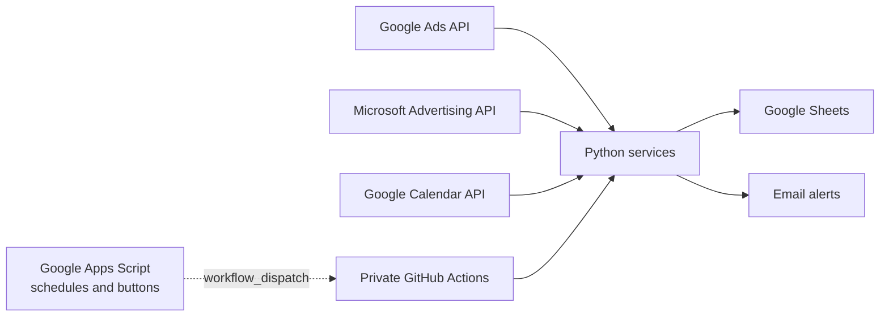

# Ads Operations Automation

**English** | [Español](README.es.md)

A SEM automation project that replaces selected daily Supermetrics queries
with direct integrations for Google Ads, Microsoft Advertising, Google Sheets
and Google Calendar.

This repository is a public, sanitized showcase of the architecture. It is not
connected to production infrastructure, contains no credentials and cannot
access real advertising accounts or spreadsheets.

## The Problem

SEM operations require two types of control to be updated every day:

1. Daily and accumulated advertising spend by account.
2. Client workbooks containing campaign performance, balances, budgets and
   historical reporting blocks.

Previously, much of this data depended on Supermetrics. This solution queries
the advertising APIs directly and writes the results to Google Sheets using
custom business rules. This provides:

- precise control over accounts, periods and statuses;
- idempotent updates without duplicate rows;
- fewer API writes through batch operations;
- support for retrospective spend adjustments;
- automated month and year transitions;
- operational checks beyond the original reporting query.

## Features

### Spend control

`scripts/actualizar_consumos.py`:

- discovers final advertising accounts under one or more manager accounts;
- includes accounts with spend even when paused or suspended;
- queries daily and monthly spend;
- refreshes the current and previous month to capture later adjustments;
- creates new monthly or yearly worksheets from existing templates;
- preserves historical data and prevents duplicates using the account ID;
- writes complete matrices to Google Sheets instead of updating cell by cell.

### SEM client workbooks

`scripts/actualizar_fichas_sem.py`:

- queries campaign metrics from Google Ads and Microsoft Advertising;
- updates clicks, CTR, CPC, cost, conversions, cost per conversion,
  impressions, impression share and daily budget;
- maintains the live reporting block for the current period;
- archives previous periods and adjusts the required number of rows;
- renders periods as `Month YYYY` and metrics with up to two decimals, without
  dangling decimal separators;
- sorts campaigns by active status and then by descending cost;
- updates account status, actual spend and the active period;
- supports multiple advertising accounts aggregated into one client workbook;
- applies exceptional rules through configuration rather than embedding
  client names in public source code.

### SEM action verification

`scripts/verificar_acciones_calendario_sem.py`:

- interprets Calendar events that request a client pause or reactivation;
- compares the expected action with the real campaign state;
- groups incidents into a single notification;
- prevents duplicate alerts;
- uses read-only access to advertising platforms.

### Apps Script

The examples under `apps-script/projects/` demonstrate how Google Apps Script
acts as the interaction and orchestration layer:

- time-driven triggers that request scheduled updates;
- refresh buttons embedded in Google Sheets;
- protection against double clicks and duplicate executions;
- GitHub Actions dispatch through `workflow_dispatch`;
- balance alerts generated from spreadsheet data.
- end-date alerts sent ahead of fixed-term campaigns, with weekend adjustment
  and duplicate suppression.

In production, Apps Script communicates exclusively with private
infrastructure. The published files use configurable properties and contain no
real repository, spreadsheet, recipient or token values.

## Architecture



Dashed arrows represent the orchestration demonstrated by the source code.
This public repository does not have that connection enabled.

See [Architecture](docs/ARCHITECTURE.md) for the complete workflow, technical
decisions and limitations of the public version.

## Repository Structure

```text
apps-script/projects/      Examples of buttons, triggers and alerts
examples/workflows/        Production workflows as non-executable examples
scripts/                   Generic Python domain logic
scripts/microsoft_ads/     Isolated Microsoft Advertising provider
tests/                     Public package contracts
config_*.example.json      Fully fictitious configuration
docs/                      Architecture and reliability boundaries
AGENTS.md, pytest.ini       Agent entry point and isolated test discovery
```

The public package is generated by `scripts/build_public_repository.py` from
an explicit allowlist. `scripts/audit_public_repository.py` then rejects real
identities, emails, account IDs, Sheet IDs, credentials, local user paths and
values known to private configuration before publication.

See [reliability boundaries](docs/RELIABILITY.md) for missing-source protection,
atomic renewal markers and the limits of the example. [AGENTS.md](AGENTS.md) is
the entry point for coding agents.

## Running The Tests

CI is the only active GitHub automation. To validate locally:

```powershell
py -3.12 -m venv .venv
.\.venv\Scripts\python.exe -m pip install -r requirements-dev.txt
.\.venv\Scripts\python.exe -m pytest -q
```

The example configurations validate the code contract without contacting
external services.

## Security And Privacy

- No real client names or identifiers are published.
- No real manager account, advertising account or Google Sheets IDs exist.
- No internal emails, tokens, credentials or private keys are included.
- Operational workflows use the `.yml.example` extension and cannot run on
  GitHub.
- The package is generated from an allowlist and audited against known private
  data before publication.

Read [SECURITY.md](SECURITY.md) before opening an issue or proposing a change.
